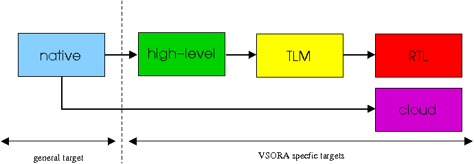

.. _development_flow:

Development Flow
================

VSLIB is a library which allows to develop complex signal processing algorithms. Typically, it is used to develop the base-band part in a communication system, between the A/D decoder / encoderd and the channel decoding / encoding block.

The main advantage of VSORA methodology is to share the **same code** from the early steps of the algorithm definition to the embedded binary which will run on the final target (SOC).

We define the different phases of a project, each one being associated with a *platform*:

.. glossary::

   native
      The ``native`` platform deals with the algorithm definition called hereafter *application*. At this stage, the main goal is to run fast simulations.

      The application is a C++ code using the :ref:`mathematical API <math_api>` and a :ref:`communication API <communication_api>` defined by VSLIB. The project can be compiled with any compiler and the application is run on a PC.

   high-level
      The ``high level`` platform is used for DSP sizing (number of cores, capacity of each core (memory+processing), interfaces). The hardware characteristics and the mapping are set with the :ref:`multicore API <multicore_api>`.

      From this stage (and for lower platforms (:term:`tlm`, :term:`rtl`, :term:`cloud`) the code **must** be compiled with VSORA compiler. The application is executed by the high-level model of the DSP and run on a PC. It is possible to monitor the code using the :ref:`tool-library <tools>`). The DSP load is a coarse (but relevant) estimation of the final target.

   tlm
      The ``tlm`` platform is used for the integration of the application with the embedded software running on the host processor. The application is executed by a low-level model (System-C / C++) of the DSP and run on a PC.

   rtl
      The ``rtl`` platform is used for the hardware implementation. The application is executed by the RTL (*Register Transfert Level*) model (VHDL) of the DSP and run on a PC. The :ref:`DSP monitoring <tools>` gives the exact load of the DSP (in terms of cycles).

   cloud
      The ``cloud`` platform is used to accelerate simulations while keeping the rtl model characteristics. The application is executed by the DSP which is mapped on a FPGA. This FPGA is physically located on a remote server (in the cloud).
